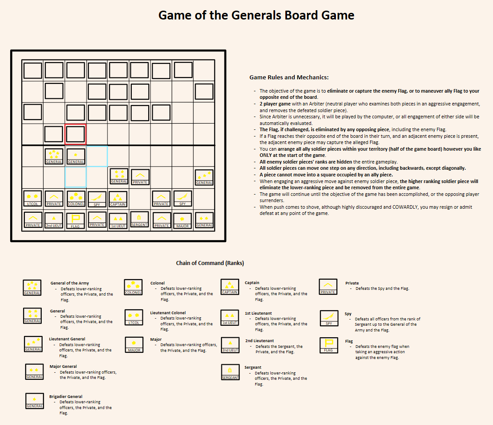
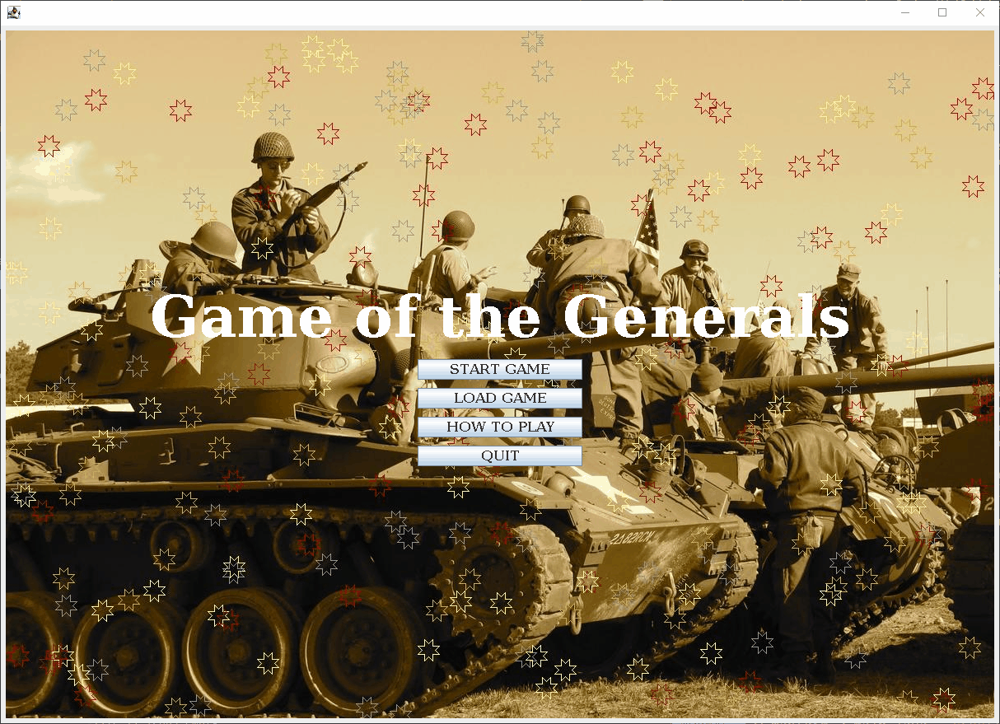

# Final Project For CISC 190 Introduction To Java

Just a simple strategy board game made in Java for my CISC 190 final project.

Game of the Generals (GoG), also known as "Salpakan", is a board game
originated in the Philippines.

More info on [Game of the Generals](https://en.wikipedia.org/wiki/Game_of_the_Generals).

  - [Final project demo video](https://www.youtube.com/watch?v=O1iplL8vho8)

JDK version used:

  - OpenJDK 8

## Resources

  - [Java Chess Engine Tutorial](https://www.youtube.com/watch?v=h8fSdSUKttk&list=PLOJzCFLZdG4zk5d-1_ah2B4kqZSeIlWtt)
  - [Java Tutorial - Creating a Minesweeper](https://www.youtube.com/watch?v=RFpJp62ZoY8&list=PLGxHvpw-PAk6QvPw0fYe8bks31GRKvymK)

